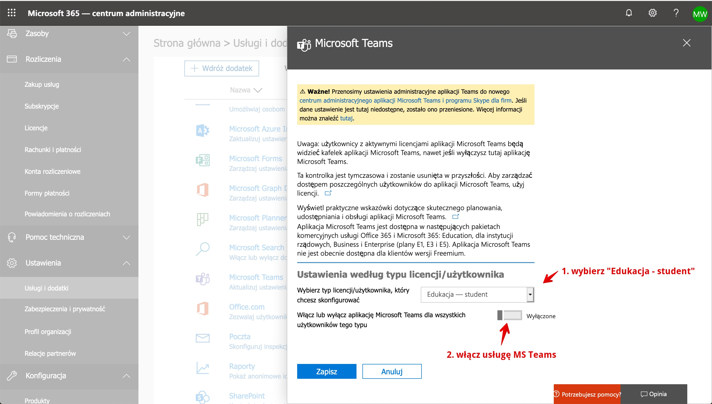
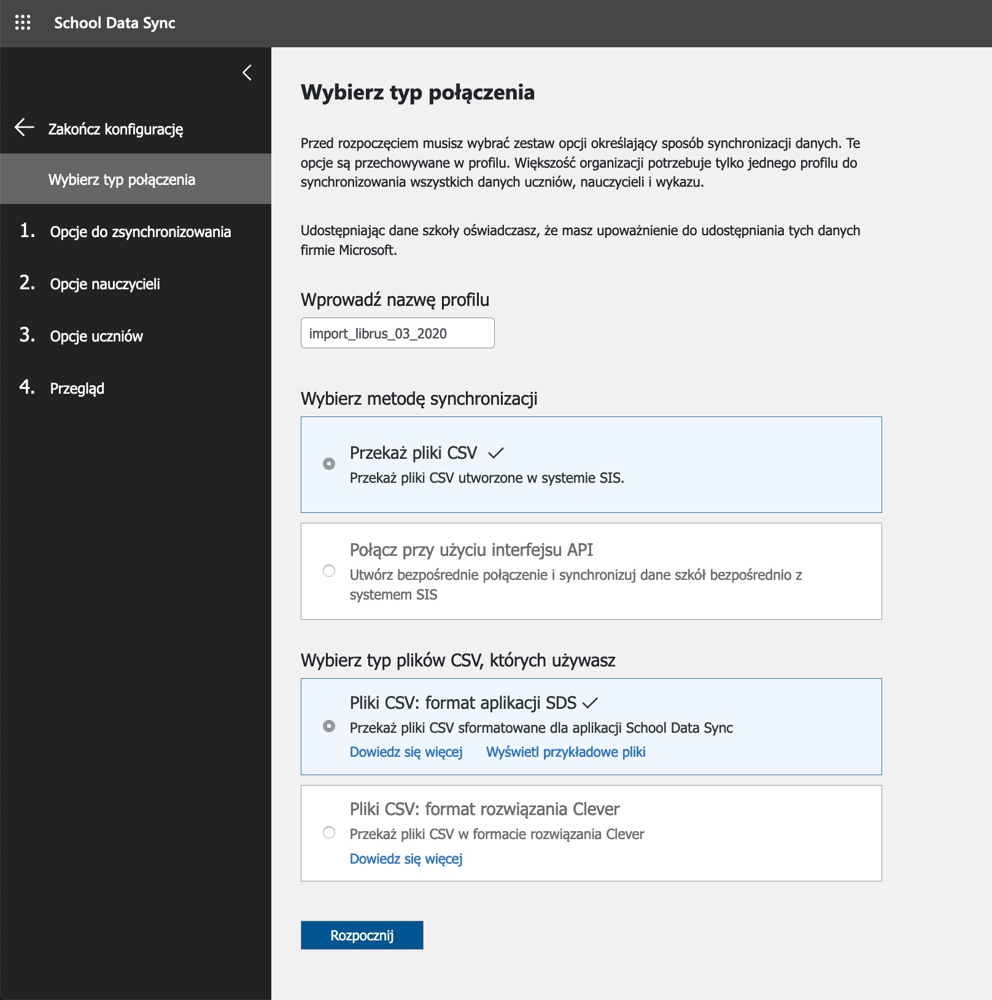
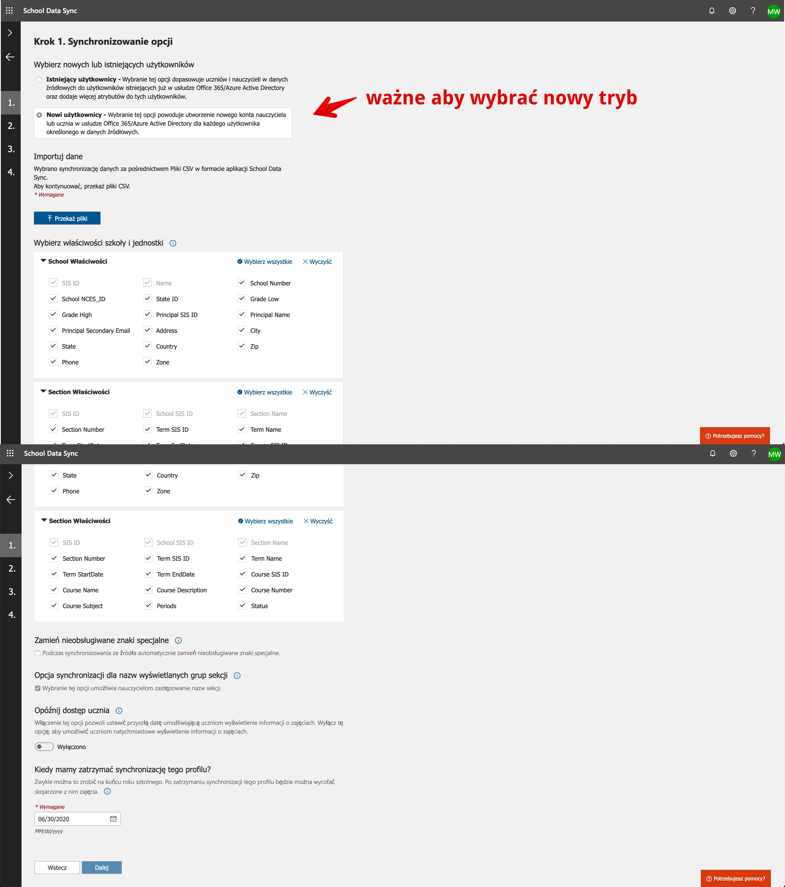

# Integracja Microsoft Teams (o365) z pakietem Librus

Poniższa paczka jest efektem współpracy non-profit podczas epidemii koronawirusa w marcu 2020 roku.

Paczka zawiera uproszczoną instrukcję krok po kroku jak poprawnie połączyć usługi Librus i MS Teams.
Na końcu jest także skrypt, który na podstawie danych generuje pliki HTML, dzięki którym można sobie przygotować plik PDF z instrukcjami dla uczniów i nauczycieli. 

## Proces migracji danych z Librusa do O365

1. Ustal pod jaką domeną będzie działała poczta oraz usługi Microsoftu 
2. Zarejestruj szkołę i darmowy pakiet A1 na stronie Microsoftu - [link](https://news.microsoft.com/pl-pl/features/aka-ms-zdalnaszkola/)
3. Skonfiguruj domenę w Panelu Administracyjnym na portal.office.com - [link](https://admin.microsoft.com/Adminportal/Home#/Domains)
4. Uzywając starego panelu administracyjnego włącz licencję dla uczniów - [link](https://admin.microsoft.com/Adminportal/Home#/Settings/ServicesAndAddIns)
    * `Ustawienia -> Usługi i dodatki` - znajdź Microsoft Teams
    * Włącz usługę MS Teams
    * 
5. Wyeksportuj dane z Librusa używając: `Narzędzia -> Exporty -> Eksport danych do formatu School Data Sync (SDS)` - [link](https://synergia.librus.pl/eksporty)
6. Rozpakuj paczkę i zmień nazwy plików z formatu **CamelCase** na **lowercase** np.
    * `School.csv` -> `school.csv`
    * `Section.csv` -> `section.csv` 
    * `Student.csv` -> `student.csv` 
    * `StudentEnrollment.csv` -> `studentEnrollment.csv` 
    * `Teacher.csv` -> `teacher.csv` 
    * `TeacherRoster.csv` -> `teacherRoster.csv` 
7. Wejdź do portalu SDS - [link](https://sds.microsoft.com)
8. Dodaj nowy **Profil**, który posłuży do importu użytkowników
   * krok 1  
   * krok 2 
   ...

## Generowanie pliku PDF z loginami i hasłami

### Zależności

Aby wygenerować pliki PDF potrzebujesz zainstalować:

* [NodeJS](https://nodejs.org/en/download/) 
* [Yarn](https://classic.yarnpkg.com/en/docs/install/)
* [Google Chrome](https://www.google.com/chrome/) lub [Chromium](https://www.chromium.org/getting-involved/download-chromium) 

### Użycie

```bash
yarn install
# yarn generate ${skonfigurowana domena w portal.office.com} ${absolutna ścieżka do katalogu z wyeksportowanymi plikami librusa}
# SDS 
yarn generate twojaszkola.pl $PWD/librus-sds-export 
```

A na końcu w katalogu, w którym są pliki CSV znajdziesz 2 pliki HTML:

* students.html
* teachers.html

Otwórz je w przeglądarce Google Chrome, a następnie użyj opcji `Drukuj -> Zapisz plik PDF` dla obu plików.